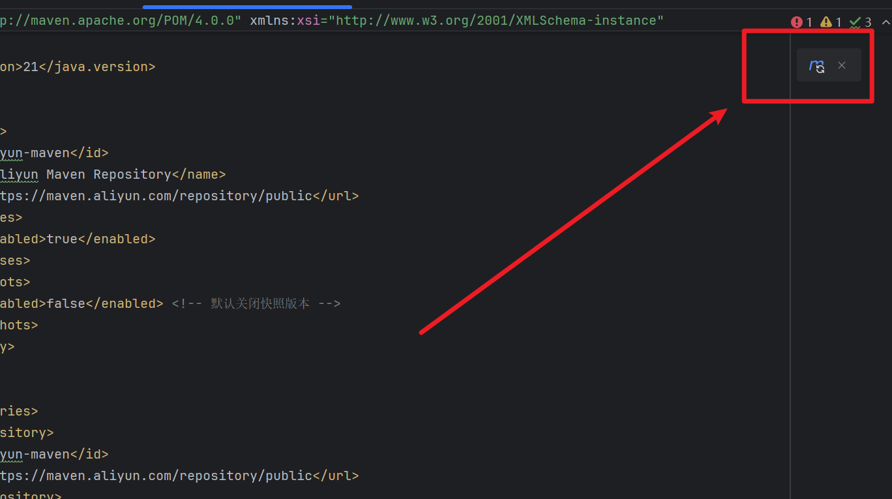

# SpringBoot入门指南

## 1.Maven

- maven是一个用来管理项目依赖的东西（当然除此以外也还具有打包项目等功能），可以认为是一个管理模块，maven几乎所有配置都可以在pom.xml中实现
  - pom.xml：一个xml文件，里面存放的是xml格式的代码，这类代码的风格一般都是`<xxx>aaa</xxx>`，xxx中表示这个模块的内容，aaa处填写这个内容的具体值
  - 理解xml时，可以直接根据英文意思
- 下面附上阿里云镜像的配置代码，配置了这个之后下载依赖会更快

```xml
<repositories>
    <repository>
        <id>aliyun-maven</id>
        <name>Aliyun Maven Repository</name>
        <url>https://maven.aliyun.com/repository/public</url>
        <releases>
            <enabled>true</enabled>
        </releases>
        <snapshots>
            <enabled>false</enabled> <!-- 默认关闭快照版本 -->
        </snapshots>
    </repository>
</repositories>

<pluginRepositories>
    <pluginRepository>
        <id>aliyun-maven</id>
        <url>https://maven.aliyun.com/repository/public</url>
    </pluginRepository>
</pluginRepositories>
```

除此以外，需要注意的是，当你更新完pom.xml后，你会发现idea会显示一个这样的图标



点击此处的图标之后会idea会根据你pom.xml里的更改对项目进行更新，因此当你更改了pom.xml之后，不要忘记点击这个按钮

maven的内容就讲到这里，关于打包相关的以后再介绍

## 2.SpringBoot入门

### 2.1Spring相关的依赖（写在pom.xml的dependencies里）

```xml
<dependency>
        <groupId>org.springframework.boot</groupId>
        <artifactId>spring-boot-starter-data-jpa</artifactId><!--spring data jpa相关-->
    </dependency>
    <dependency>
        <groupId>org.springframework.boot</groupId>
        <artifactId>spring-boot-starter-thymeleaf</artifactId><!--thymeleaf相关，前端框架-->
    </dependency>
    <dependency>
        <groupId>org.springframework.boot</groupId>
        <artifactId>spring-boot-starter-web</artifactId><!--可以认为是springboot的核心-->
    </dependency>
    <dependency>
        <groupId>com.mysql</groupId>
        <artifactId>mysql-connector-j</artifactId>
        <version>8.0.33</version> <!--mysql驱动（根据你的mysql版本选择version，一般来说只要大版本相同就没问题（比如说你是8.4.xx，那么你用8.x.xx一般都是可以的，当然完全相同肯定是最好））-->
    </dependency>
    <dependency>
        <groupId>org.projectlombok</groupId>
        <artifactId>lombok</artifactId><!--lombok依赖-->
        <version>1.18.36</version>
        <optional>true</optional>
        <scope>provided</scope>
    </dependency>
    <dependency>
        <groupId>org.springframework.boot</groupId>
        <artifactId>spring-boot-starter-test</artifactId>
        <scope>test</scope><!--spring的测试环境-->
    </dependency>
```

### 2.2项目的一般结构

- 三个"层"，每个层下可以再细分
  - entity 与数据库直接接触的层，同时也具有着“承担数据”的功能（就像结构体，entity给出数据类型的定义）可以再将entity拆分成三层：
    - entity 仅作为数据类型定义
    - DTO 仅和数据库接触
    - POJO 没有特别的规定，一般用来实现一些特殊的需求
  - service 业务代码的实现地点，绝大多数的代码在这里编写，service层也可以拆分为两层
    - repository 一般是和数据库交互的内容实现/接口，像我们如果用spring data jpa，那么这里面就可以写jpa提供的像findByxxx之类的函数定义
    - service 本身（当然这里可以再拆分，比如说再加个接口变为service接口和接口实现两块）
  - controller 控制器，与前端相连，接受前端的请求并且做出对应的反应
    - 一般不再分层，不过你可以通过他的作用分类成不同的Controller，比如HomeController（主要与主页面相关的请求），VideoController（主要处理VideoService相关的请求，比如addVideo，search之类的）

**需要注意的是，这些层仅仅是一个规范，具体的命名并不是死的，当然按照我这里的命名或者未来项目里的命名规范肯定是最好**

---

### 2.3各个层的特征/标记

- **spring为这三个层提供了对应的注解标记，以此让对应的代码发挥对应的作用**

- **entity层**
  
  - **@Entity** 标记这个类为实体
  
  - **@Table** 如果这个类和数据库中某个表是一一对应的，那么请加上这个注解
    - 例如`@Table(name = "xxx")`，xxx是数据库里这个类对应的表名
    - ```java
      @Entity
      @Table(name = "video")
      public class Video {
        private @Id @GeneratedValue(strategy = GenerationType.IDENTITY) Long id;
        private String name;
        private String description;
	    }
	    ```


  - **service层**
    
    - **service 本身**
      - @Service注解，标记这个类为Service
    
    - **repository** （这里只描述spring data jpa的repository）
      - 不需要注解，但是因为我们用的是jpa所以需要继承springboot给的父类，即`extends JpaRepository<Video,Long>`
      - 其中`<Video,Long>`这里的Video代表**这个Repository对应的数据库里的表对应的entity类是Video类**，Long则代表这个类在表中储存所使用的主键（一般来说填Long就对了）
    
  - **controller层**
    
    - **@Contoller**
    - **@RestController**
    - 区别：
    
      - 
        |       特性       | `@Controller`                             | `@RestController`                             |
        | :--------------: | ----------------------------------------- | --------------------------------------------- |
        |     **本质**     | 传统MVC控制器，返回视图名称或ModelAndView | `@Controller` + `@ResponseBody` 的组合注解    |
        | **默认响应类型** | 视图 `Content-Type: text/html`            | 直接返回数据 `Content-Type: application/json` |
	    |   **适用场景**   | 前后端不分离（服务端渲染(比如thymeleaf)） | 前后端分离（RESTful API）                     |
    
    - 实际上**`@RestController` 是组合注解**，他等价于：
	
		- ```java
	    @Controller
	    @ResponseBody
	    public class XXXController { ... }
	    ```

### 2.4层与层之间的连接方式

>  阅读完上面几点，你会发现我们目前仅仅定义了三个层面具体应该写些啥，能够实现啥，但是并不能让这三个层结合在一起（互相帮助），即这三个层是互相孤立的，而spring在这里给出了他的解决方案

- 解决方案：**依赖注入**

- 首先，依赖注入是什么？为什么需要依赖注入呢？

  - 依赖注入，即将一个层中的对象注入到另一个层，从而让那个层得以调用原本层的方法

    - 你可能会想说，我直接new一个不就好了吗？
    - 实际上，除了你可能已经猜到的，依赖注入带来的解耦优势以外，最大的优势其实是在于**集中管理**
    - 即spring框架会替你管理依赖注入下来的那些对象的**生命周期**，**Spring统一管理Bean（即你注入下来的那些东西，比如videoService，我们一般都叫他Bean）的生命周期（如单例模式复用对象、自动销毁资源），避免冗余创建和内存浪费（其实就是比较底层的东西）**

  - 依赖注入的方式主要有两种（我推荐大家做的有两种）

    - 第一种，最无脑的`@Autowired`注解

    - 以下面这份代码为例，我们在ApiController中，需要用到VideoService的getVideos方法，于是我们在类里写明了` private VideoService videoService;`，并且为其加上了`@Autowired`注解，这样，在`all()`方法中，当我们接收到外界的`/api/videos`的Get请求时，就可以调用`videoService`的`getVideos()`方法，完成我们所想要做到的业务

      ```java
      @RestController
      public class ApiController {
          @Autowired
          private VideoService videoService;
          @GetMapping("/api/videos")
          public List<Video> all(){
             return videoService.getVideos();
          }
      }
      ```

    - 第二种，通过构造函数注入

    - 你会发现这里没有`@Autowired`，而是多了一个`ApiController`的构造函数（并且以`VideoService`为参数），这样也可以达到上面代码的效果

      ```java
      @RestController
      public class ApiController {
          private final VideoService videoService;
          public ApiController(VideoService videoService) {
              this.videoService = videoService;
          }
          @GetMapping("/api/videos")
          public List<Video> all(){
              return videoService.getVideos();
          }
      }
      ```

  - 这两种方式有区别吗？答案是有，但不多。

  - 如果观察细心，你会发现：

    - `@Autowired`对应的`videoService`没有`final`关键字，而构造函数注入的service是可以有`final`关键字的（`final`修饰的变量的是不可更改的，如果被更改则会编译报错，也就是根本运行不了）
    - 因此构造函数注入的service实际上是更加稳定的，因为final关键字可以防止别的开发者对service进行修改导致程序出现一些你排查不到的错误
    - 举个例子，你的`VideoService`中有一个字段sort，他定义了某种排序方式，由于某种原因我们不希望更改这个排序方式，然而随着开发时间的推进，可能未来的某些业务中又需要更改这个排序方式，于是他人将排序方式更改了（比如通过`videoService.xxx()`即某个函数来修改）

  - 当然这种情况很少发生，因为由于我们在`videoService`里定义的字段大多都是`private`的，别的地方如果没有`setter`这类的方法（如果有的话那一般也是允许更改的hh），是更改不到我们service里的字段的
